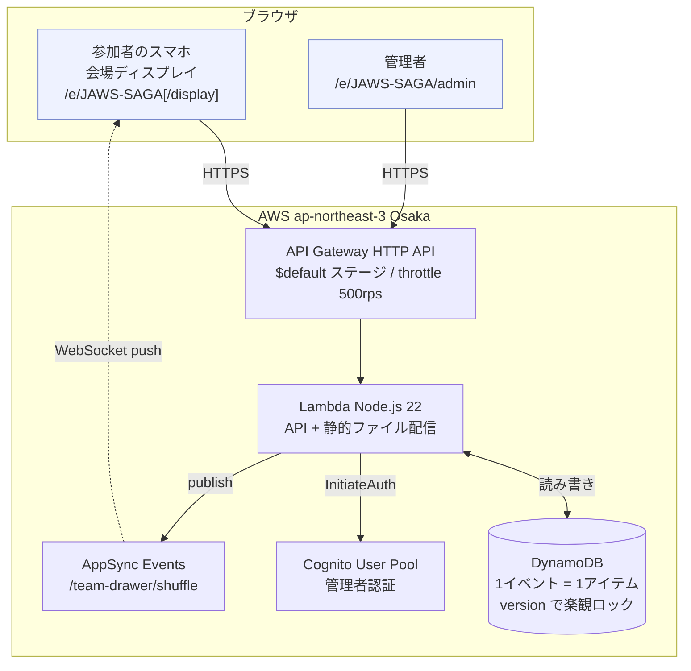
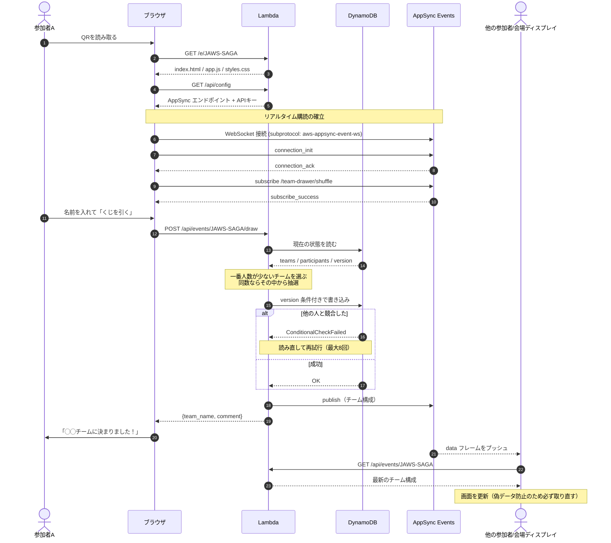
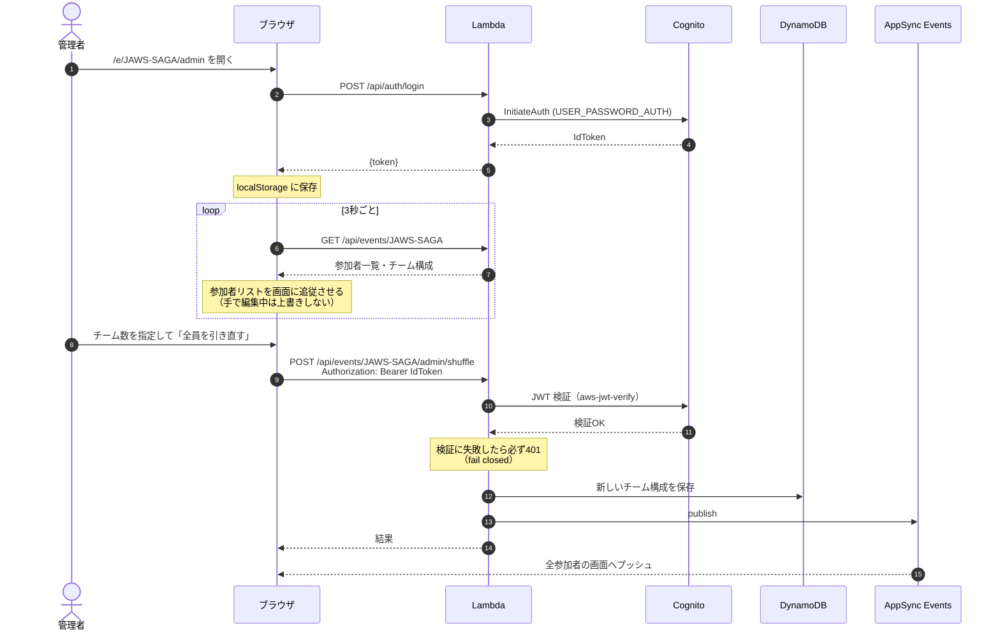

# ランダムチーム割り当て（くじ引き）Webサービス — AWS 版

参加者を任意のチーム数にランダム振り分けする「くじ引き」サービス。
JAWS-UG佐賀 ワークショップ向けに、**管理者がシャッフルを実行 → 参加者は公開URLで結果を閲覧**する構成。

> このブランチ（`AWS-Optimize`）は AWS 上で動く構成です。
> Cloudflare Workers / D1 版は `main` ブランチを参照してください。

## 機能

- **参加者向け画面**（認証不要 / `/e/{code}`）
  - 名前を入れて「くじを引く」→ **その場でチーム確定**（管理者の操作は不要）
  - 人数に応じて一番少ないチームに入るので、事前の人数見積もりが不要
  - 自分のチームを大きく表示。他チームの状況もリアルタイムで反映
- **会場表示モード**（認証不要 / `/e/{code}/display`）
  - 参加用の **QRコード** と URL をプロジェクタ向けに大きく表示
  - チーム状況をリアルタイム更新
- **管理画面**（Cognito 認証必須 / `/e/{code}/admin`）
  - 参加状況の確認
  - **チーム数・チーム名の変更**（引き直しなし。すでに引いた人のチームは動かない）
  - **参加者の削除**（名前の ✕ で個別 / 「参加者を全員削除」でまとめて）
  - 「全員を引き直す」（チーム数を変えてやり直したいとき用）
  - 割り当てのリセット

チーム名は佐賀弁（がばい・そいぎ・やーらしか …）から自動採番し、
チームごとに佐賀弁のひとことコメントが付きます。
リアルタイム反映は AppSync Events（3秒ポーリングのフォールバック併用）。

## 構成

| 役割 | サービス |
|---|---|
| 画面配信 + API | API Gateway HTTP API（`$default` ステージ）→ Lambda |
| データ保存 | DynamoDB（1イベント = 1アイテム） |
| 管理者認証 | Cognito User Pool（`USER_PASSWORD_AUTH`） |
| リアルタイム更新 | AppSync Events（チャンネル `/team-drawer/shuffle`） |
| IaC | AWS CDK |

### 構成図



**ポイント**

- 静的ファイル（HTML/CSS/JS）も Lambda が配信するため、CloudFront や S3 は使いません。単発イベント用の割り切りです
- API Gateway は **HTTP API の `$default` ステージ**。REST API だと URL が `/prod/...` になり、フロントの絶対パスが届かなくなります
- リアルタイム更新は AppSync Events の **WebSocket プッシュ**。通知はトリガーにするだけで、**画面に出すデータは必ず API から取り直します**（第三者が publish しても偽データが出ない）
- 3秒ポーリングを併用しているため、WebSocket が繋がらなくても結果は反映されます

### シーケンス図: 参加者がくじを引く



### シーケンス図: 管理者のログインと引き直し



## セットアップ

```bash
npm install
npx cdk bootstrap aws://<ACCOUNT_ID>/ap-northeast-3   # 初回のみ
```

## デプロイ

管理者パスワードは環境変数で渡します（リポジトリに平文で置かないため）。
**必ず使い捨てのパスワードを使ってください**。指定した値は CloudFormation
テンプレートに平文で残ります（詳細は `docs/AWS_DEPLOY.md`）。

```bash
ADMIN_PASSWORD='YourStrongPassw0rd' \
ADMIN_EMAIL='admin@example.com' \
npm run cdk:deploy
```

完了後、`ParticipantUrl` と `AdminUrl` が出力されます。

### デプロイ時に指定できる環境変数

| 変数 | 既定 | 説明 |
|---|---|---|
| `ADMIN_PASSWORD` | （必須） | 管理者パスワード。8文字以上・大小英字と数字を含む |
| `ADMIN_EMAIL` | `admin@jaws-ug-saga.example.com` | 管理者のログインID（Cognito ユーザー名） |
| `EVENT_CODE` | `JAWS-SAGA` | イベントコード。URL `/e/{code}` とデータの保存キー |
| `EVENT_TITLE` | `JAWS-UG佐賀 チーム割り当て` | 画面に表示するイベント名（60文字以内） |
| `APP_REGION` | `ap-northeast-3` | デプロイ先リージョン |

別コミュニティで使い回す例（`JAWS-SAGA` → `JBUG-SAGA`）:

```bash
EVENT_CODE='JBUG-SAGA' \
EVENT_TITLE='JBUG佐賀 チーム割り当て' \
ADMIN_PASSWORD='YourStrongPassw0rd' \
npm run cdk:deploy
```

参加用URLは `/e/JBUG-SAGA`、画面上部の見出しも `JBUG佐賀 チーム割り当て` になります。

`EVENT_CODE` は自動で大文字化され、英数字とハイフン・32文字以内かを検証します。
コードもタイトルも画面側はサーバ (`/api/config`) から受け取るため、フロントの修正は不要です。
チーム名とひとことコメントは佐賀弁のままなので、そこも変えたい場合は
`src/api.ts` の `SAGA_WORDS` と `src/comments.ts` を差し替えてください。

**イベントコードを変えると、DynamoDB 上では別キーになるためまっさらな状態から始まります。**
旧コードのデータは残りますが読み書きとも 404 になるので、
当日の朝にコードを変えて再デプロイすれば、テストデータの消し忘れを気にせずに済みます。

リージョン既定は **ap-northeast-3 (Osaka)**。切り替えは `APP_REGION` のみ:

```bash
APP_REGION=ap-northeast-1 ADMIN_PASSWORD='...' npm run cdk:deploy
```

詳細な手順・設計判断・実装ログは [`docs/AWS_DEPLOY.md`](docs/AWS_DEPLOY.md) を参照。

## テスト

```bash
npm test        # 単体 + DynamoDB Local を使った統合テスト（Docker 必要）
npm run typecheck
```

Docker が無い環境では、純粋ロジックの単体テストのみ実行されます。

## ローカルで画面を確認する

デプロイせずにブラウザで動作を確認できます（Docker 必要）。

```bash
./scripts/dev.sh   # http://localhost:3000/e/JAWS-SAGA
```

DynamoDB Local を起動し、サンプルのチーム分け結果を入れた状態でサーバが立ちます。
Cognito はローカルに無いため、管理者操作（シャッフル・リセット）は 401 になります。

## API 概要

| メソッド | パス | 認証 | 説明 |
|---|---|---|---|
| GET | `/api/config` | 不要 | フロント用の設定値（Cognito / AppSync） |
| POST | `/api/auth/login` | 不要 | Cognito ログイン（ID トークンを返す） |
| GET | `/api/events/{code}` | 不要 | チーム分け結果・参加者一覧 |
| POST | `/api/events/{code}/draw` | 不要 | くじを引く（body: `{ display_name }`）。その場でチーム確定 |
| POST | `/api/events/{code}/participants` | 不要 | 参加者登録のみ（body: `{ names: string[] }`） |
| POST | `/api/events/{code}/admin/teams` | 必要 | チーム数・チーム名の変更（body: `{ team_count, team_names }`）。引き直しはしない |
| POST | `/api/events/{code}/admin/remove-participants` | 必要 | 参加者を個別削除（body: `{ names: string[] }`） |
| POST | `/api/events/{code}/admin/clear-participants` | 必要 | 参加者を全員削除（チーム構成は残す） |
| POST | `/api/events/{code}/admin/shuffle` | 必要 | シャッフル実行（`Authorization: Bearer <IDトークン>`） |
| POST | `/api/events/{code}/admin/reset` | 必要 | 割り当てリセット（チーム名も消える） |

### 消す操作の使い分け

| 操作 | 参加者 | チーム名・チーム数 | 使いどころ |
|---|---|---|---|
| 個別削除（名前の ✕） | その人だけ消える | 残る | 二重登録・テストで入れた名前を消す |
| 参加者を全員削除 | 全員消える | **残る** | 同じチーム構成のまま最初からやり直す |
| リセット | 全員消える | 消える | チーム構成ごと作り直す |

個別削除・全員削除とも、残った人のチームは動きません。
削除は参加者リストとチームの両方から消えるので、消した人がくじを引き直すと新規参加者として扱われます。

### チーム構成の変更（`/admin/teams`）

管理画面の「チーム構成」から、チーム数とチーム名を変えられます。
**引き直しとは別操作**で、すでにくじを引いた人のチームは動きません。

| 操作 | 挙動 |
|---|---|
| 名前だけ変更 | メンバーはそのまま。チームのひとことコメントも引き継ぐ |
| チーム数を増やす | 増えた分は空のまま。次にくじを引いた人から入る（一番少ないチームに入るため） |
| チーム数を減らす | 消えたチームの人は、人数の少ないチームへ移る |
| 誰も引く前に実行 | 空のチームだけ用意できる。当日 1 人目から狙ったチーム名で始まる |

チーム名を空欄にすると佐賀弁から自動で付きます（既存の名前とは重複しません）。
チーム名の重複は 400 で弾きます（チームは名前で識別しているため）。
チーム数の上限は 20、チーム名は 20 文字までです。

## ディレクトリ構成

```
├── public/           # 静的ファイル（HTML, CSS, JS）
├── src/              # Lambda（API ルーティング・DynamoDB 操作・認証）
│   ├── handler.ts    #   エントリポイント（ルーティング / 静的配信）
│   ├── api.ts        #   チーム分けロジック・エンドポイント実装
│   ├── db.ts         #   DynamoDB アクセス
│   ├── auth.ts       #   Cognito ID トークン検証
│   ├── comments.ts   #   佐賀弁ひとことコメント
│   └── events.ts     #   AppSync Events publish
├── cdk/              # CDK スタック定義
├── test/             # テスト
├── scripts/          # 開発用スクリプト
└── docs/             # 仕様・デプロイ手順・実装ログ
```

## ライセンス

MIT
